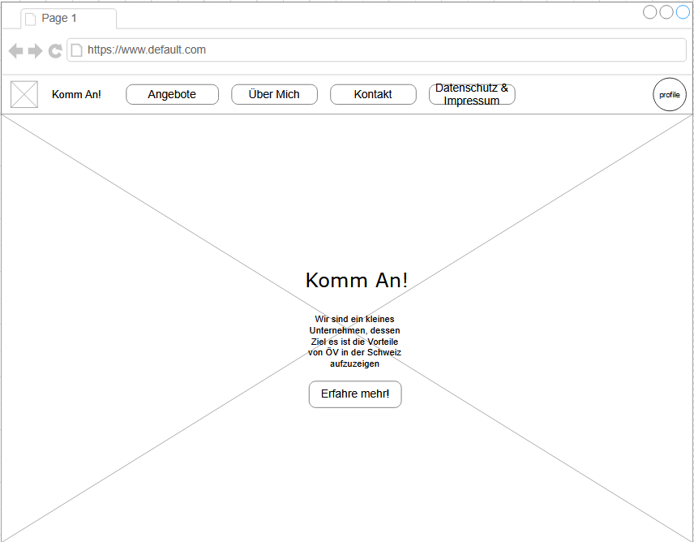
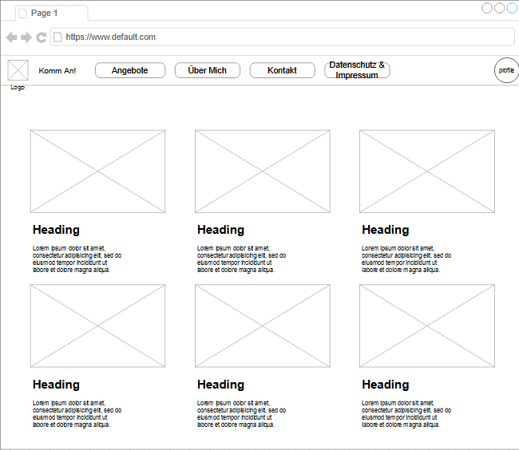
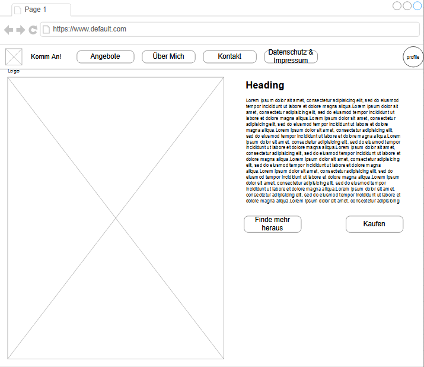
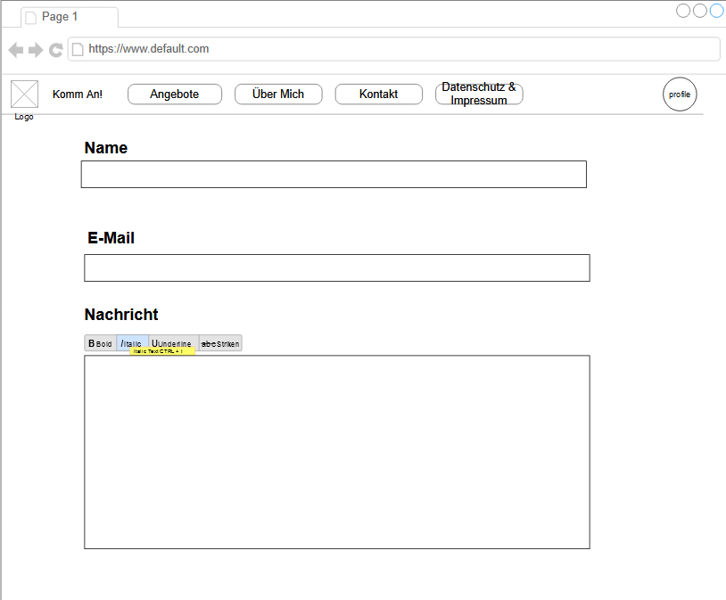
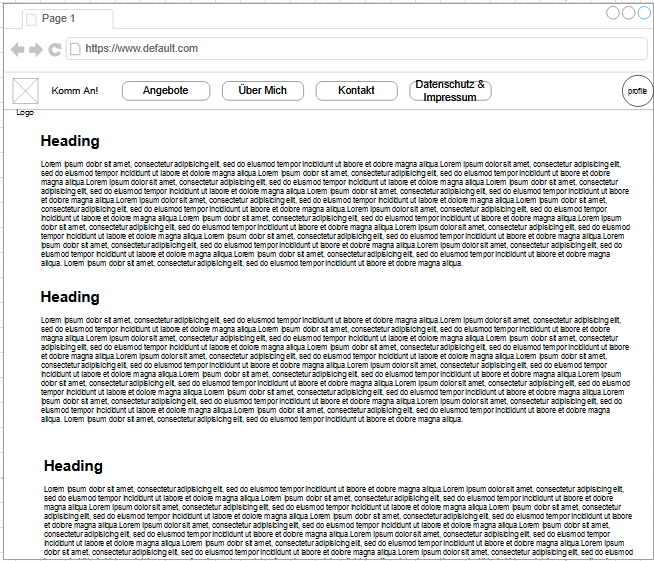

# Dokumentation Multimedia Website

## Idee Firma

In diesem Kapitel stelle ich meine Idee für die Firma vor die ich in Form vom "Multimedia Website Auftrag" umsetzen konnte.  
Meine Idee ist es den öffentlichen Verkehr der Schweiz, darzustellen denn es gibt sehr viele Möglichkeiten wie man in der Schweiz von einem Ort zum anderen zu gelangen. Dazu werde ich einige Angebote von verschiedenen ÖV anbietern zusammengefasst und auf einer modernen Webseite darstellen. Die Bilder zu dieser Webseite werde ich selber schiessen und mit Photoshop bearbeiten. Diese Firma heisst **Komm An!**

## Entwurf Webseite

### Homepage

### Angebote

### Über Mich

### Kontakt

### Datenschutz & Impressum

## Entscheidungsmatrix

In diesem Kapitel habe ich verschiedene Tools Gegeneinander in einer Entscheidungsmatrix Gegeneinandergestellt. Duch mein Punktesystem konnte ich herausfinden welches Tool am besten zu meiner Arbeit passt.

### Kriterien

#### Photo Bearbeitungstool:

1. **Einfach zum benutzen:** Misst die Benutzerfreundlichkeit und Intuitivität des Tools. Ein höherer Wert zeigt an, dass das Tool einfacher zu erlernen und zu bedienen ist.
2. **Features & Funktionalität:** Bewerte die Anzahl und Vielfalt der verfügbaren Funktionen im Tool. Ein höherer Wert zeigt an, dass das Tool mehr Funktionen und Möglichkeiten bietet.
3. **UI:** Bewerte das Design des Benutzerinterfaces. Ein höherer Wert zeigt an, dass das Benutzerinterface attraktiv und gut gestaltet ist.
4. **Kompatibilität:** Misst die Fähigkeit des Tools, mit verschiedenen Betriebssystemen und Dateiformaten umzugehen. Ein höherer Wert zeigt eine größere Kompatibilität an.
5. **Günstig:** Bewertet, ob das Tool kostengünstig ist. Ein höherer Wert zeigt an, dass das Tool entweder kostenlos oder relativ preiswert ist.

#### Javascript Framework:

1. **Einfach zum benutzen:** Misst die Benutzerfreundlichkeit und Intuitivität des Frameworks. Ein höherer Wert zeigt an, dass das Framework einfacher zu erlernen und zu bedienen ist.
2. **Features & Funktionalität:** Bewerte die Anzahl und Vielfalt der Funktionen und Fähigkeiten des Frameworks. Ein höherer Wert zeigt an, dass das Framework mehr Funktionen und Möglichkeiten bietet.
3. **Flexibilität:** Bewertet, wie anpassungsfähig das Framework ist. Ein höherer Wert zeigt an, dass das Framework leichter an verschiedene Anforderungen und Projekte angepasst werden kann.
4. **Performance:** Bewerte die Geschwindigkeit und Effizienz des Frameworks. Ein höherer Wert zeigt an, dass das Framework schnell und leistungsstark ist.
5. **Popularität:** Misst, wie weit verbreitet und akzeptiert das Framework ist. Ein höherer Wert zeigt an, dass das Framework populärer ist.

### Photo Bearbeitungstool

| Kriterium                 | Gewichtung | Photoshop | Canva | Gimp | MS Paint |
| ------------------------- | ---------- | --------- | ----- | ---- | -------- |
| Einfach zum benutzen      | 1.5        | 2         | 5     | 2    | 3        |
| Features & Funktionalität | 1          | 5         | 2     | 4    | 2        |
| UI                        | 0.5        | 3         | 4     | 3    | 2        |
| Kompatibilität            | 1          | 5         | 2     | 4    | 2        |
| Günstig                   | 1          | 5         | 5     | 5    | 5        |
| Total                     |            | 19.5      | 18.5  | 17.5 | 14.5     |

### Javascript Framework

| Kriterium                 | Gewichtung | Svelte | React | Angular | Solid |
| ------------------------- | ---------- | ------ | ----- | ------- | ----- |
| Einfach zum benutzen      | 1.5        | 4      | 3     | 3       | 3     |
| Features & Funktionalität | 1          | 3      | 4     | 5       | 4     |
| Flexibilität              | 1.5        | 3      | 4     | 3       | 5     |
| Perfomance                | 0.5        | 5      | 4     | 4       | 4     |
| Popularität               | 1          | 3      | 5     | 3       | 2     |
| Total                     |            | 18.5   | 19.5  | 18      | 17    |
